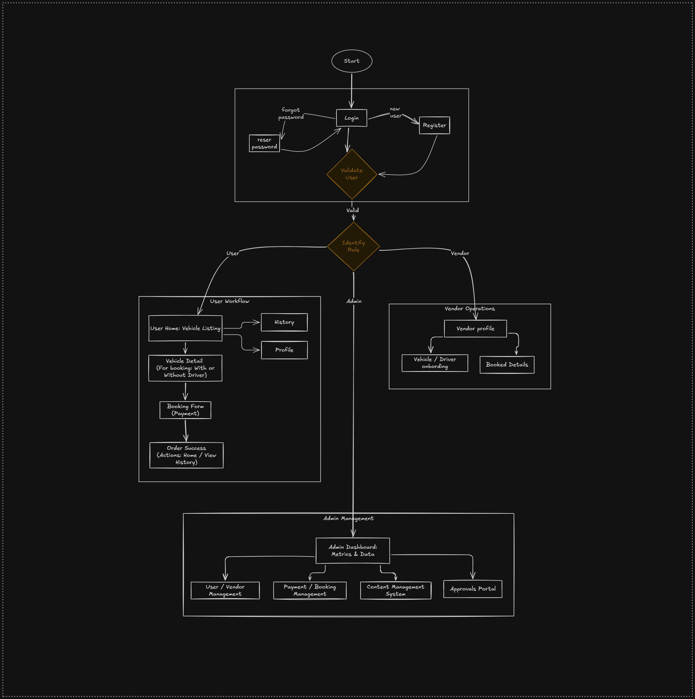
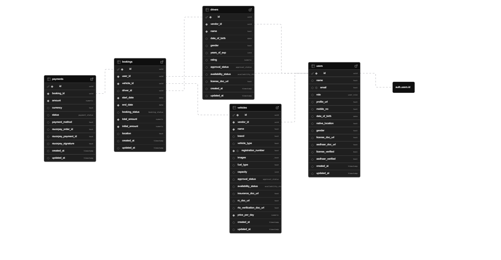

# Carvona Application

Carvona is a comprehensive vehicle booking and management platform designed to streamline the experience for users, vendors, and administrators. It provides a seamless interface for browsing vehicles, managing bookings, and handling administrative tasks.

## Application Architecture

### High-level Flow Diagram

### Database Design

## Technology Stack

- **Framework**: [Next.js 16](https://nextjs.org) (App Router)
- **Database & Auth**: [Supabase](https://supabase.com)
- **Styling**: [Tailwind CSS 4](https://tailwindcss.com)
- **UI Components**: [Radix UI](https://www.radix-ui.com), [shadcn/ui](https://ui.shadcn.com)
- **Icons**: [Lucide React](https://lucide.dev)
- **Validation**: [Zod](https://zod.dev)

## Project Structure

The project follows a standard Next.js directory structure within the `src` folder:

- **`src/app`**: Contains the application routes, layouts, and page-specific logic, organized into route groups:
  - `(auth)`: Authentication-related pages (login, signup, etc.).
  - `(protected)`: Routes restricted to authorized users (admin and vendor dashboards).
  - `(user)`: User-facing pages like profile, bookings, and vehicle details.
- **`src/actions`**: Server actions for handling form submissions and data mutations.
- **`src/components`**: Reusable React components organized by feature (booking, forms, home, layout, ui, vehicles).
- **`src/service`**: Business logic and API client abstractions (auth, bookings, drivers, users, vehicles).
- **`src/lib`**: Utility functions, query builders, and Supabase client configuration.
- **`src/types`**: TypeScript definitions and interfaces.
